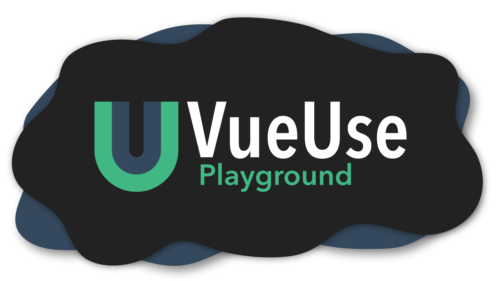

  

  <a href="https://play.vueuse.org">Visit Playground</a>

  <b>
    Live Collaboration · Shareable Playgrounds · Many built-in tools
  </b>

  

## Features

### Live Collaboration
VueUse Playground allows you to collaborate on your playgrounds with others via a shareable link.

### WindiCSS
Built-in support for WindiCSS with attributify mode enabled out of the box.

### Shareable Playgrounds
You can save and share your playgrounds for others to see. You can also login via Github and access all your previous playgrounds anywhere you go.

## Roadmap

Coming Soon :)

## Special Thanks

This project was made possible due to the work of many others!

* [Evan You](https://github.com/yyx990803)
* [Anthony Fu](https://github.com/antfu) 
* [Bizzycola](https://github.com/bizzycola) 
* [Patak](https://github.com/patak-js) 
* All the contributors to this project 

## License
[MIT License](https://github.com/jacobclevenger/vite-plugin-vue-gql/blob/main/LICENSE) © 2021-PRESENT [Jacob Clevenger](https://github.com/jacobclevenger)